# Mentorship Platform Backend

## Overview
This project is a backend service for a mentoring platform, built using modern technologies. The system supports registration, authentication, user profile management, messaging, feedback (reviews), and email verification.

## Technology Stack
- **Language:** Java 21
- **Framework:** Spring Boot 3 (Web, Security, Data JPA, Validation, WebSocket, Mail)
- **Scheduling & Async:** Spring Scheduling (@Scheduled), Async Executor (custom AsyncConfig)
- **Database:** PostgreSQL
- **Migrations:** Flyway
- **Authentication:** JWT 
- **Object Storage:** Amazon S3 
- **Build Tool:** Maven
- **Code Generation:** Lombok
- **Containerization:** Docker & Docker Compose
- **Validation:** Jakarta Bean Validation (Hibernate Validator via starter)
- **Email:** Spring Boot Mail (SMTP-based verification emails)
- **Logging:** SLF4J + Logback (default Spring Boot setup)

## Core Features
- User registration and authentication (JWT)
- Email verification
- Profile management (create, update, upload photo)
- Real-time chat between users
- Mentor reviews (create, update, list)
- Mentor search and filtering

## Getting Started
1. Clone the repository and enter the project directory.
2. Configure environment variables (see `application.properties`).
3. Start Docker Compose:
   ```bash
   docker compose up -d
   ```
4. Application will be available at: http://localhost:8080

## Project Structure
**packages:**
- `controller` — REST controllers
- `service` — business logic layer
- `repository` — data access layer
- `dto` — data transfer objects
- `entity` — JPA entities
- `security` — security configuration
- `config` — configuration classes
- `scheduler` — scheduled task classes
- `specification` — dynamic JPA specifications for filtering
 
**branches:**
- `master` - backend
- `main` - frontend ( Angular)

## Screenshots of the application in operation
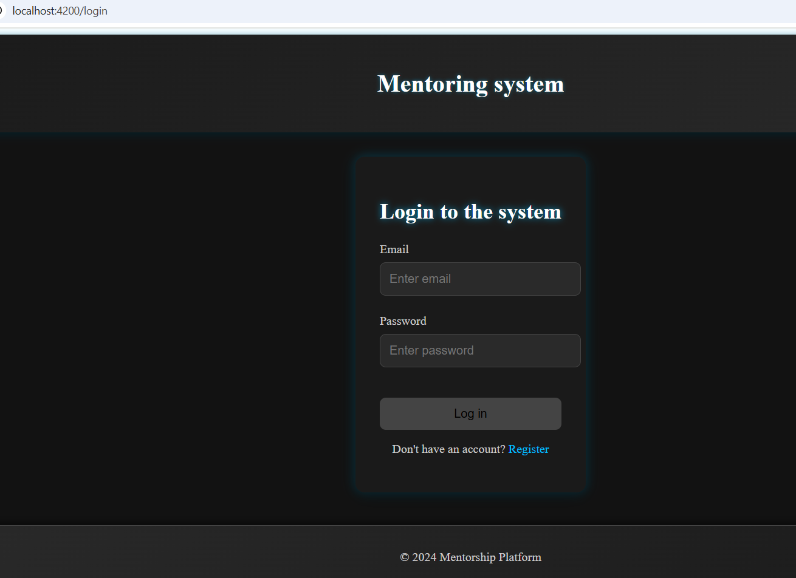
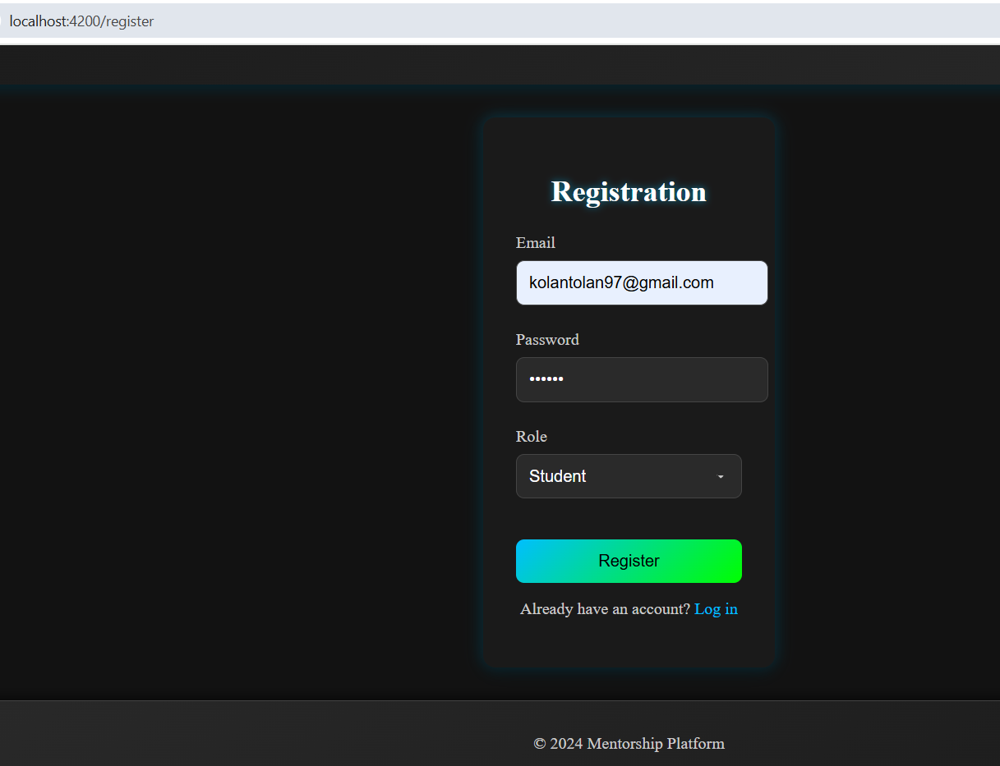
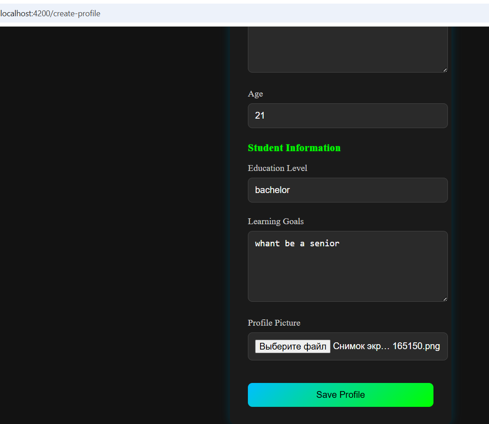
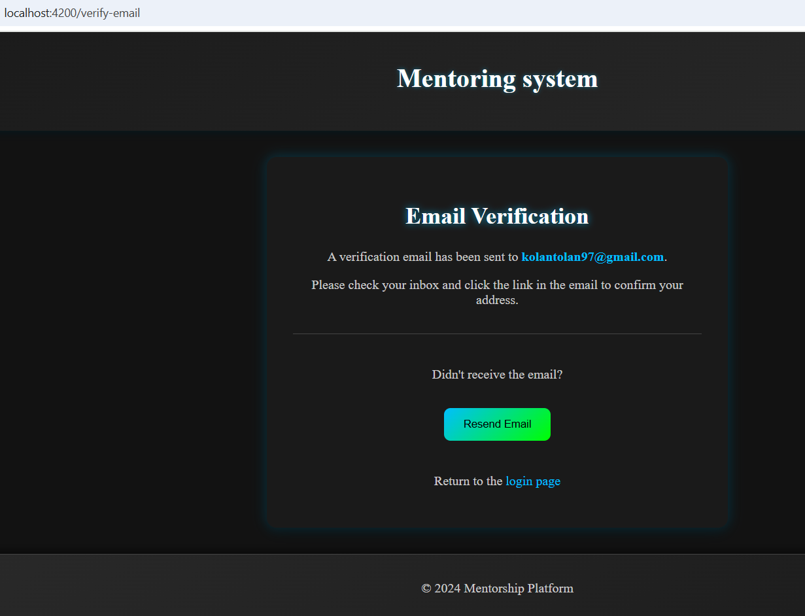
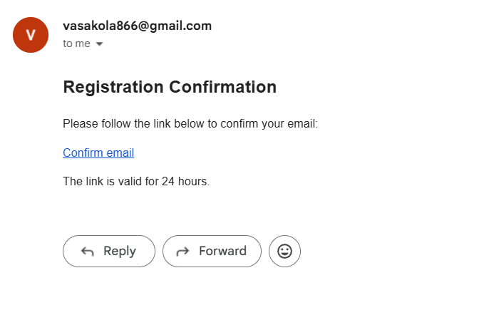
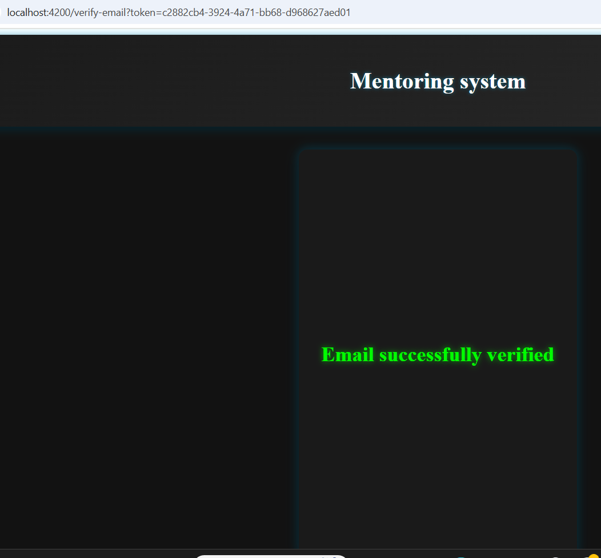
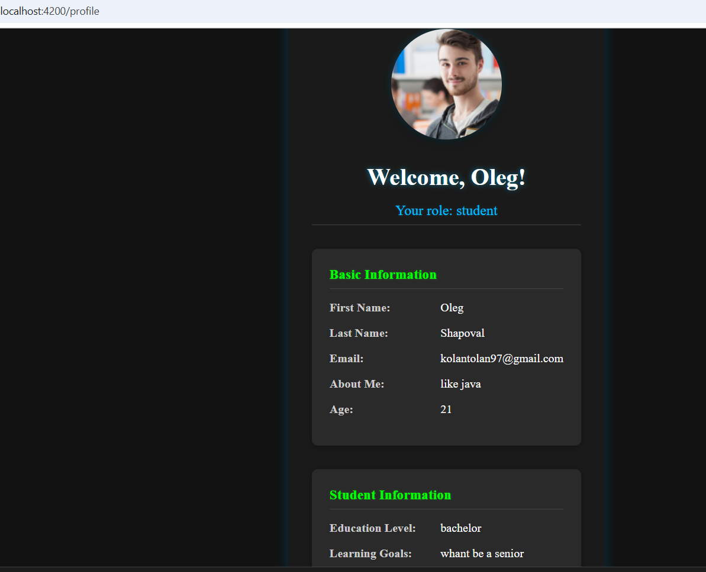
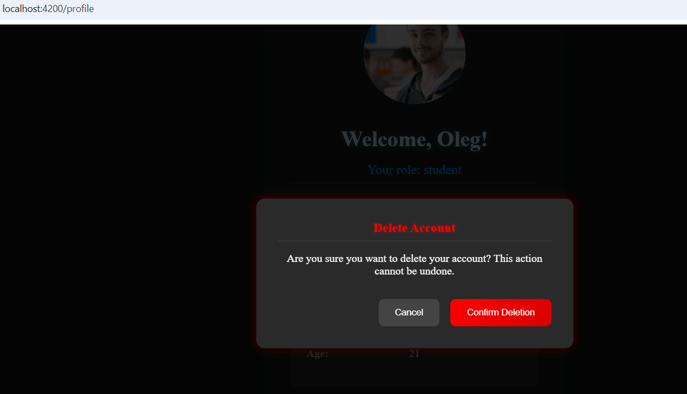
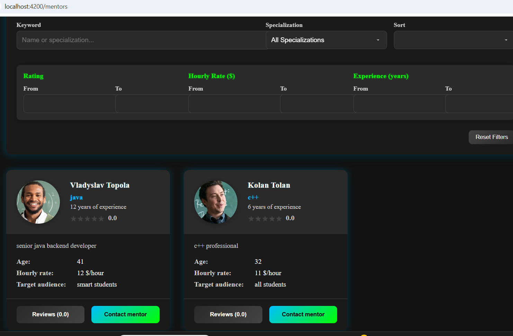
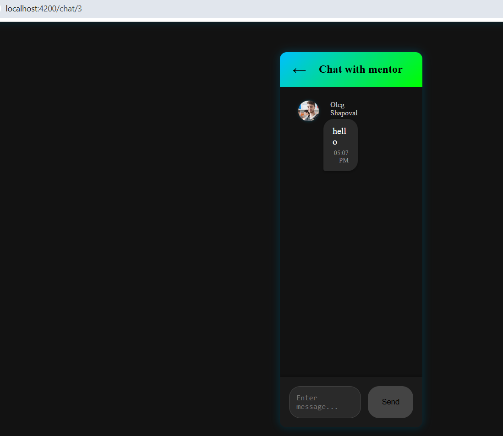
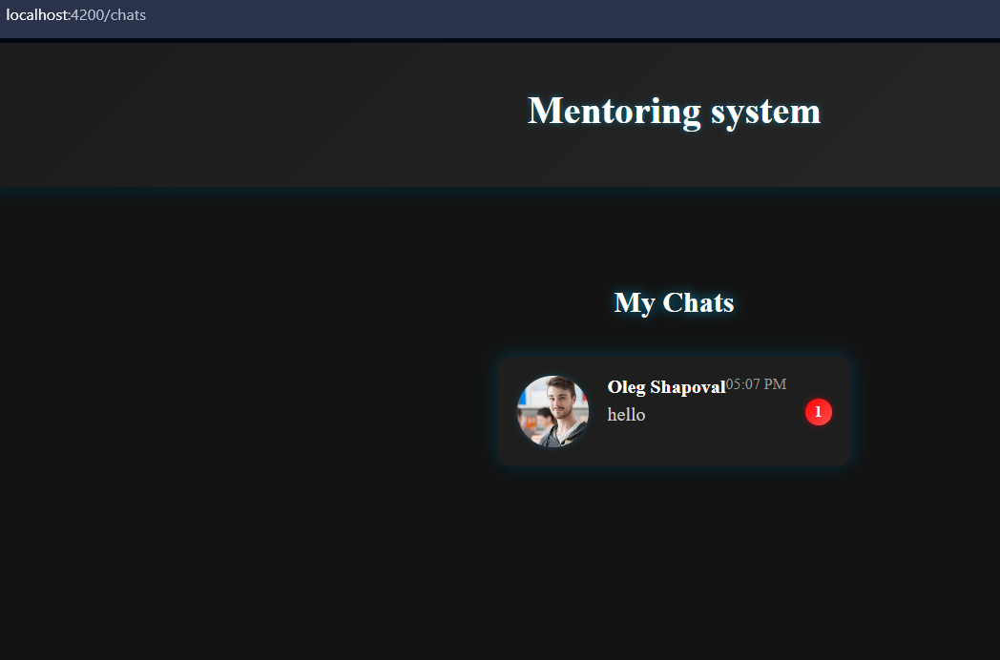
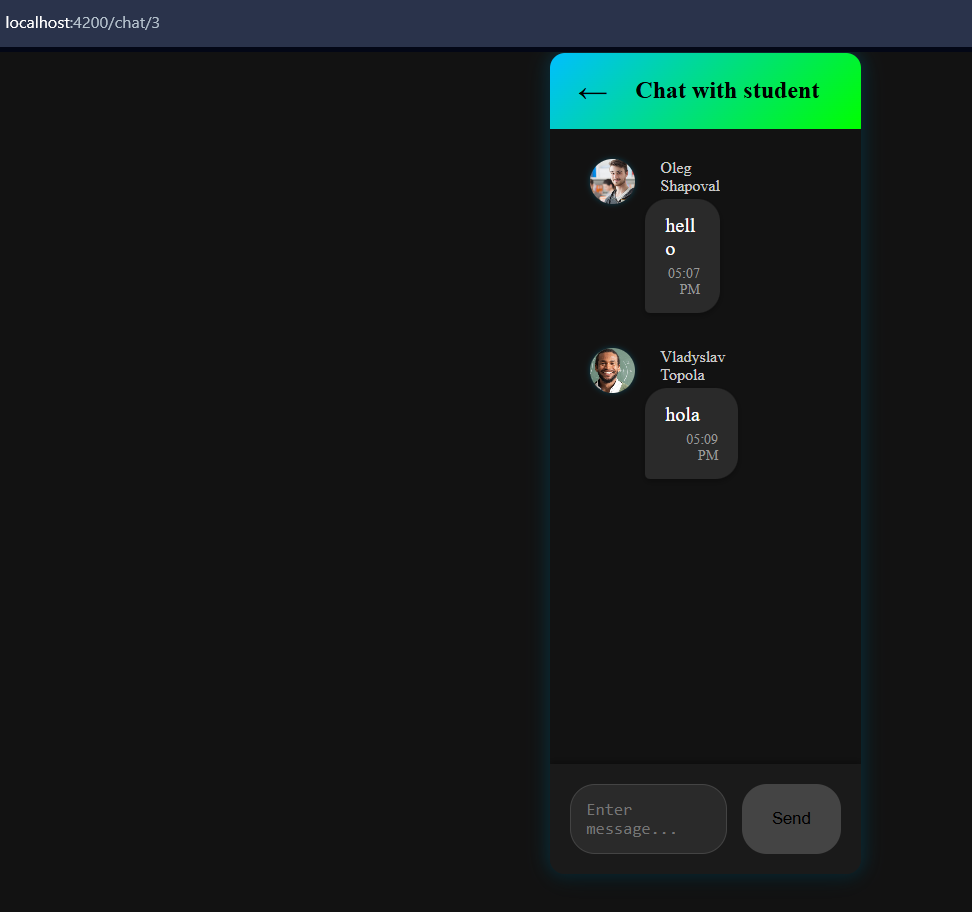
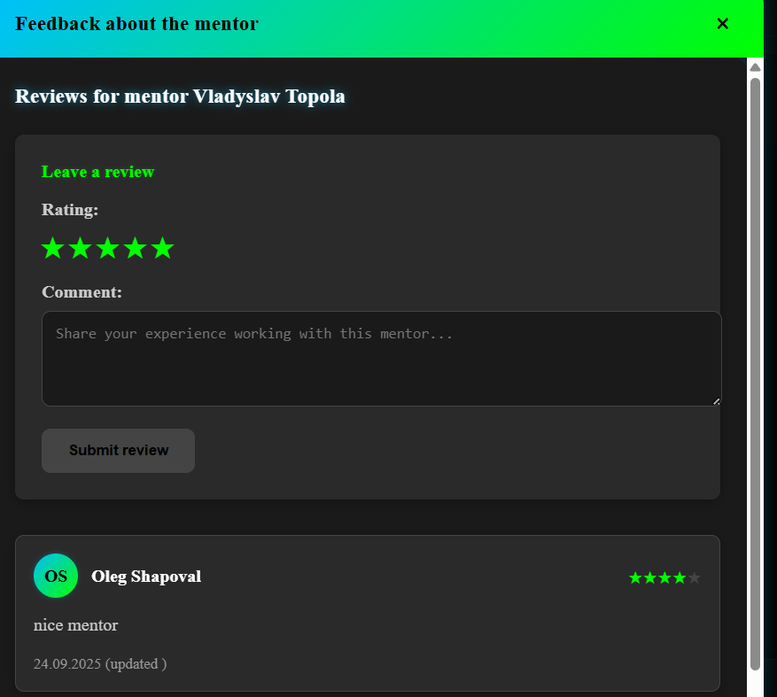
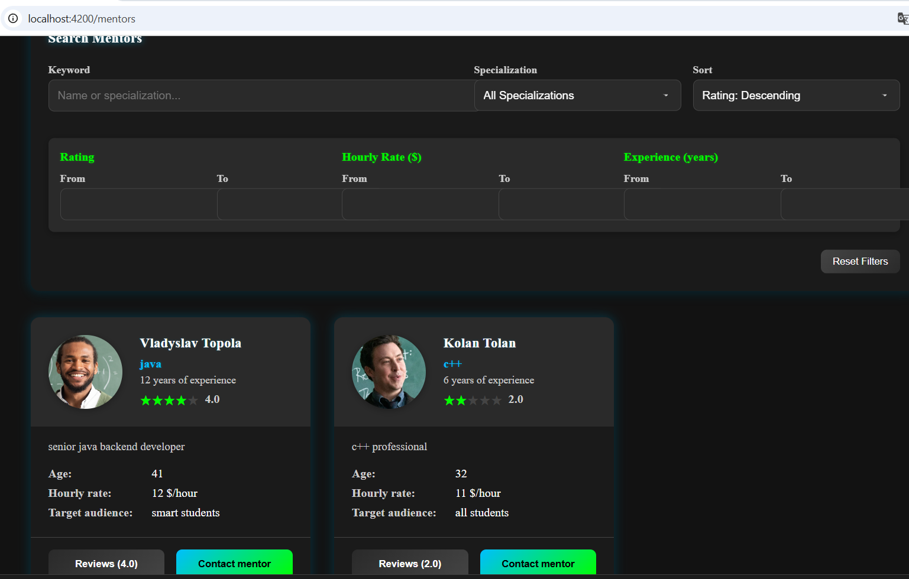